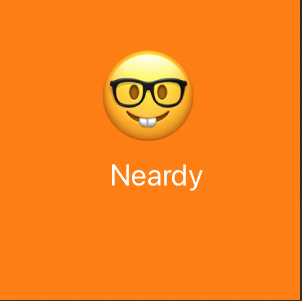

# My first playground

In this playground I'm getting familiar with Swift's syntax indepth and using xcode playground to watch step by step what I'm building.

## What did I build?

Well, just a simple iterator that build from a dictionary a series of cards with emojis and their meaning

